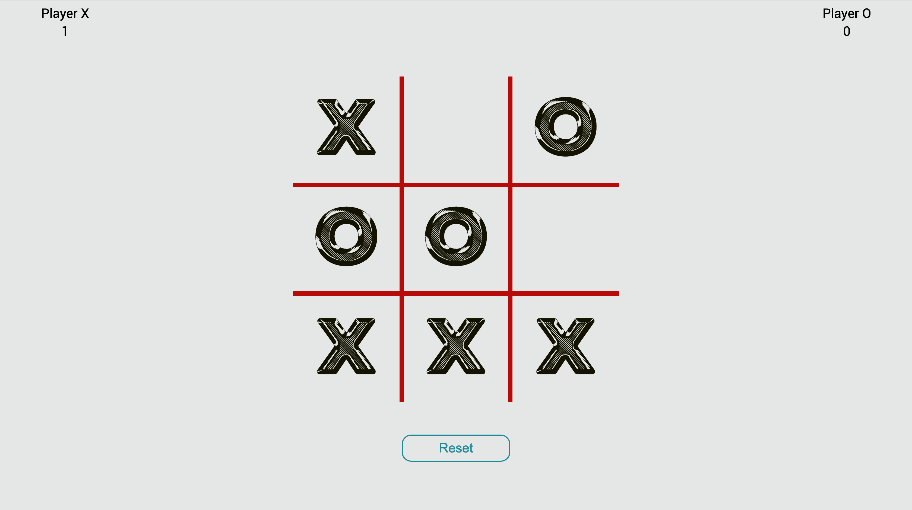

# Tic-Tac-Toe 
This is Tic-Tac-Toe created with vanilla JavaScript. 
## Skills learned during this project
- JavaScript module design pattern. 
- JavaScript revealing module design pattern. 
- JavaScript factory functions. 
- PubSub design pattern. Also called an eventEmitter or mediator. 
- Module decoupling using PubSub. 
## You can play the game by [clicking this link](https://bshowen.github.io/Tic_Tac_Toe_JavaScript/)!